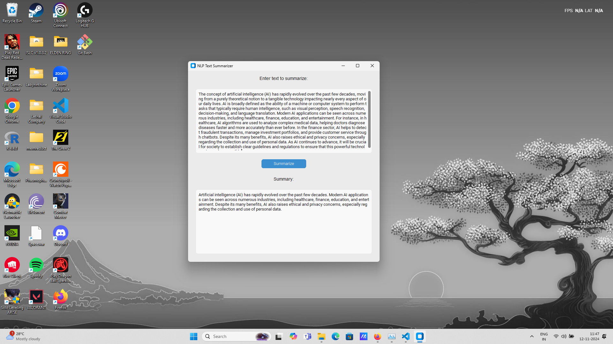

# Modern Text Summarizer

This is a GUI-based text summarizer application built with `customtkinter` and powered by a pre-trained NLP model (BART) from Hugging Face's `transformers` library. It provides a modern interface where users can input text and receive a concise summary. The BART model is specifically fine-tuned for summarization, making this application effective for condensing long texts into shorter versions.

## Features
- **Text Summarization using NLP**: Utilizes the BART transformer model, a powerful NLP model for generating high-quality text summaries.
- **Modern GUI**: Built with `customtkinter`, providing a clean interface.
- **Single Executable**: Can be packaged as a standalone executable for easy distribution.

## How It Works
1. **Tokenization**: The input text is tokenized using the BART tokenizer.
2. **Summarization**: The BART model processes the tokens to generate a summary, leveraging techniques like beam search and length constraints.
3. **Post-Processing**: The generated tokens are decoded back into readable text and displayed in the output box.

## Screenshots


## Installation

1. **Clone the repository**:
    ```bash
    git clone https://github.com/yourusername/modern-text-summarizer.git
    cd modern-text-summarizer
    ```

2. **Install the dependencies**:
    ```bash
    pip install -r requirements.txt
    ```

   **Required Libraries**:
   - `transformers`: For loading the BART model and tokenizer.
   - `torch`: For running the BART model on CPU or GPU.
   - `customtkinter`: For creating a modern-looking GUI.

   You can also install these dependencies manually:
   ```bash
   pip install transformers torch customtkinter

    Run the application:

    python text_summarizer_gui.py

Converting to an Executable

To create a standalone executable, use pyinstaller:

pip install pyinstaller
pyinstaller --onefile --windowed text_summarizer_gui.py

This will create an executable in the dist folder, which you can run independently.

Large File Storage

If you directly want the dist and dict folders it is uploaded in dropbox (link attacehed below):

Dropbox

Dependencies

    transformers (for the BART model)
    torch (to support the model)
    customtkinter (for the GUI)

Additional Notes

    Natural Language Processing (NLP): This application uses NLP to perform text summarization with the BART model, a sequence-to-sequence transformer model that is well-suited for text generation tasks.
    Model and Tokenizer: The facebook/bart-large-cnn model from Hugging Face is used, which is fine-tuned for generating concise summaries from longer texts.
